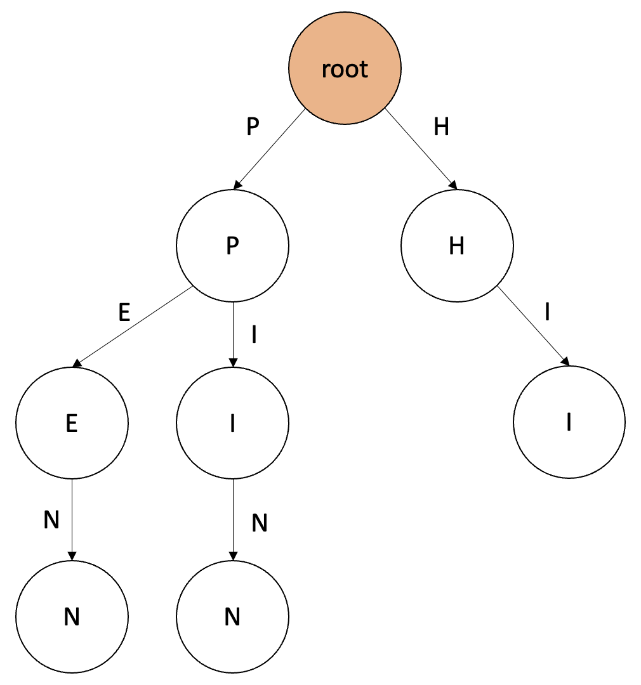
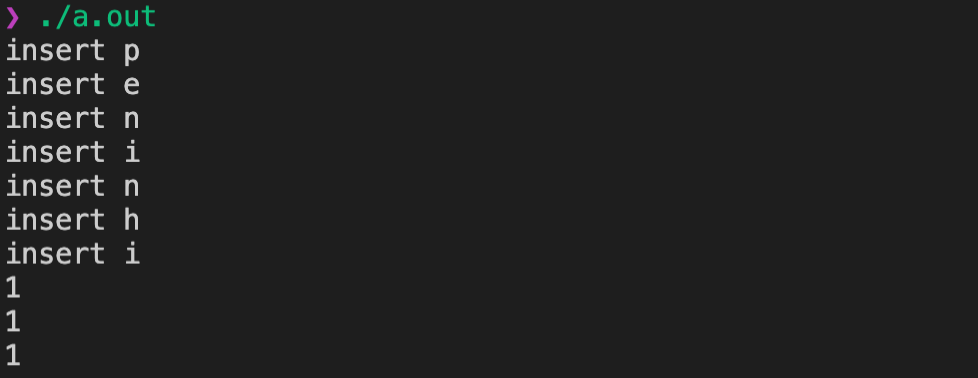
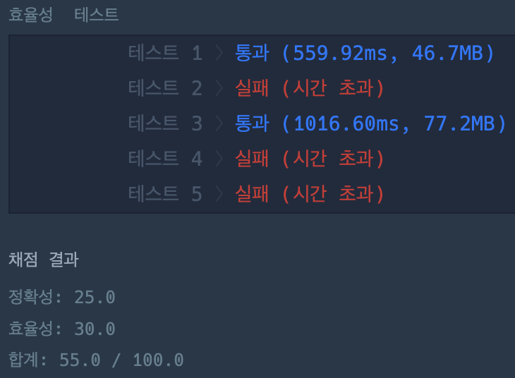

# Trie (Prefix-tree, Digital-tree, Retrival-tree) 자료구조

검색어 자동완성 등에 사용되는 트라이 자료구조에 대해 소개합니다.
제 Notion 기술 블로그의 [포스팅](https://shyuuuuni.notion.site/Trie-Prefix-tree-Digital-tree-Retrival-tree-53e0906540034fc19dba0b8948214880)에서도 확인할 수 있습니다.

## 왜 필요할까?

이진 탐색 트리와 같이 N개의 원소 중에서 우리가 원하는 원소를 탐색하는 시간은 일반적으로 $O(log n)$ 시간복잡도를 가진다. 그러나 만약 원소의 타입이 문자열이라면, 문자열을 비교하기 위해서 문자열의 길이만큼 추가로 시간이 걸리게 된다. 즉, $O(m log n)$ 시간복잡도를 가진다.

따라서 문자열을 빠르게 검색하기 위해서 고안된 자료구조가 바로 트라이(Trie) 이다.

## 트라이란?



앞서 말한대로 문자열을 빠르게 검색하고, 관리하기 좋은 자료구조로, 문자열의 집합을 표현하는 트리 자료구조의 일종이다.

위의 예시에서는 트라이 자료구조에 “PEN”, “PIN”, “HI” 라는 문자열 집합을 입력한 경우를 보여주는 예시이다. 가장 위의 root 노드는 항상 길이가 0인 문자열에 대응된다. 이후 root 노드 아래에 자식 노드로 이어나가면서 트라이 자료구조를 확장할 수 있다.

## 트라이의 구성

- 트라이 자료구조의 확장은 접두사(Prefix)가 연결된 문자열들이 부모-자식 관계를 맺으면서 확장한다.
- 종료 노드를 설정하여 해당 문자열까지가 집합에 포함되어 있다는 것을 나타내야 한다.
    - 예를 들어 위의 예시에서 종료 노드를 표시하지 않으면 트라이 자료구조 내에 “PEN”, “PE”, “P” 등 여러 문자열이 집합에 포함될 수 있다.
    - 따라서 우리가 원하는 “PEN”, “PIN”, “HI” 라는 문자열들만 종료 노드임을 나타내주어야 한다.
- 트라이의 각 노드는 다음을 저장한다.
    - **해당 노드가 종료 노드인지를 나타내는 변수**
    - **자식 노드를 나타내는 포인터 목록**

## 특징

1. 탐색의 시간 복잡도는 $O(m)$ 이다.
2. 자식 노드를 탐색하는 시간을 줄이기 위해서 자식 노드를 나타내는 포인터 배열이나 해시맵을 사용한다. (따라서 공간복잡도가 굉장히 크다.)
3. 루트 노드에서 어떤 노드까지 내려왔을 때, 만나는 글자들을 모두 모으면 검색하고 있는 노드의 접두사(Prefix)를 얻을 수 있다.

## 구현

```cpp
#include <bits/stdc++.h>
using namespace std;

class Trie {
    private:
        int toInteger(char alphabet) {
            return alphabet - 'a';
        }

    public:
        bool isTerminal;
        Trie* children[26];

        Trie() {
            this->isTerminal = false;
            for (int i=0; i<26; i++) {
                this->children[i] = NULL;
            }
        }

        void insert(const string str) {
            Trie* cursor = this;
            for (char element : str) {
                if (!cursor->children[toInteger(element)]) {
                    cursor->children[toInteger(element)] = new Trie();
                    cout << "insert " << element << "\n";
                }
                cursor = cursor->children[toInteger(element)];
            }
            cursor->isTerminal = true;
        }

        bool find(const string str) {
            bool result = true;
            Trie* cursor = this;
            for (char element : str) {
                if (!cursor->children[toInteger(element)]) {
                    result = false;
                    break;
                }
                cursor = cursor->children[toInteger(element)];
            }
            return result;
        }
};

int main(void) {
    Trie trie;
    trie.insert("pen");
    trie.insert("pin");
    trie.insert("hi");
    cout << trie.find("pen") << "\n";
    cout << trie.find("pin") << "\n";
    cout << trie.find("hi") << "\n";
    return 0;
}
```



## 연관문제

- [2020 카카오 코딩테스트 - 가사 검색](https://programmers.co.kr/learn/courses/30/lessons/60060?language=cpp) : 사실 이 문제를 풀려고 정리한 글이다. 처음에 Map 자료구조로 최대한 최적화를 해 보았지만 아무리 해도 정확성 테스트와 효율성 테스트 2문항만 통과하는 것이 전부였다. 트라이 자료구조를 적용하면서, 추가적인 데이터로 자식 노드로 내려갔을 때 종료 노드가 몇개인지 세어준다면 해결 할 수 있다.
    - 당시 틀린 코드
        
        ```cpp
        #include <bits/stdc++.h>
        using namespace std;
        
        vector<int> solution(vector<string> words, vector<string> queries) {
            vector<int> answer;
            map<string, int> db[10000+1];
            for (auto word : words) {
                string s = word;
                int len = (int)s.size();
                bool is_exist = false;
                string tmp = s;
                
                // 앞에서부터 i개의 ?를 붙인 경우, abcde, ????? 포함
                for (int i=0; i<=len; i++) {
                    if (0 < i) tmp[i-1] = '?';
                    if (!is_exist && db[len].find(tmp) == db[len].end()) {
                        db[len][tmp] = 1;
                    } else {
                        db[len][tmp]++;
                        is_exist = true;
                    }
                }
                
                is_exist = false;
                tmp = s;
                // 뒤에서부터 i개의 ?f를 붙인 경우, abcde, ?????제외
                for (int i=len-1; 0<i; i--) {
                    tmp[i] = '?';
                    if (!is_exist && db[len].find(tmp) == db[len].end()) {
                        db[len][tmp] = 1;
                    } else {
                        db[len][tmp]++;
                        is_exist = true;
                    }
                }
            }
            for (auto query : queries) {
                answer.push_back(db[(int)query.size()][query]);
            }
            return answer;
        }
        ```
        
        