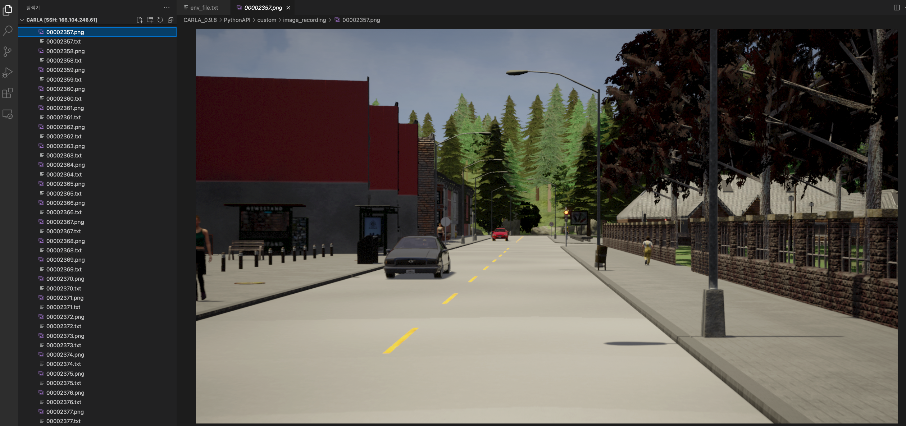

# File Remover

## 연속된 숫자 형식의 파일들을 지워주는 프로그램



프로젝트 진행 중 프레임 번호 단위로 이미지 파일과 해당 시점의 설정 정보들을 순서대로 저장하는 경우가 존재하였고, 몇몇 파일들에 문제가 발생하여 잘 적용되지 않는 부분들이 발생하였다.
이에 해당 부분들을 데이터클렌징 해야할 필요성을 느꼈고, 해당 문제를 수정하기 전까지 문제가 있는 부분들을 삭제하기로 했다.
프로젝트를 리눅스 원격 서버로 접속하여 사용하다보니, 프로그램적으로 자동으로, 정확하게 삭제하는 프로그램이 있으면 편할 것 같아서 작성하게 되었다.

## Usage

파이썬3 (혹은 더 낮은 버전)이 필요하다.
파일을 다운받고 파일의 경로에서 아래와 같은 명령어를 실행한다.

```
$ python3 file_remover --path=your_path/ --target=target_file --type=recoding
```

* --path 에는 삭제할 파일들이 있는 디렉토리의 경로를 입력한다. 끝에 '/'를 붙이는 것을 추천한다.
* --target 에는 삭제할 파일들을 설정 파일로 저장하여 그 경로를 입력한다.
* --type 에는 삭제할 파일의 타입을 설정한다.

## Expansion

### --target=target_file.txt

target_file.txt는 한 줄에 하나 혹은 두개의 번호를 입력 할 수 있다.
번호 하나만 있을 경우 해당 번호를 포맷화한 파일만을 삭제한다.
숫자가 두개일 경우 [첫번째 번호, 두번째 번호] 범위의 모든 포맷화한 파일을 삭제한다.

예를 들어 `1500 1600` 이라고 적혀있다면, 위의 예제 코드처럼 실행할 경우 00001500.png, 00001501.png, ..., 00001600.png 와 같이 삭제한다.

### --type=recoding

type은 내가 진행한 프로젝트 상에서 삭제에 필요한 몇몇 버전을 정의해 둔 것이다.
'gt' 라는 타입은 000000.jpg부터 999999.jpg까지 존재하며, 숫자를 해당 포맷에 맞춰서 변환시켜준다.
'recoding' 이라는 타입은 00000000.png부터 9999999.png 와 00000000.txt부터 99999999.txt까지 이미지와 설정 정보를 모두 가지고 있고, 숫자를 해당 포맷에 맞춰서 변환시켜준다.

추가적인 타입을 설정하고 싶다면, 19번째 라인의 to_format() 함수를 수정하면 된다.

## Changes

* 2022.03.27, --type=gt 일 경우 path 내에 있는 gt.txt 파일에서 frame 번호가 삭제할 프레임 번호일 경우 해당 라인을 제거한 gt_after.txt 로 저장하는 기능 추가
